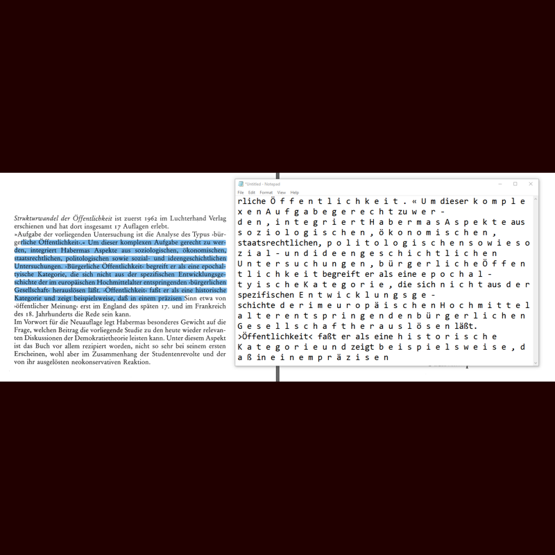
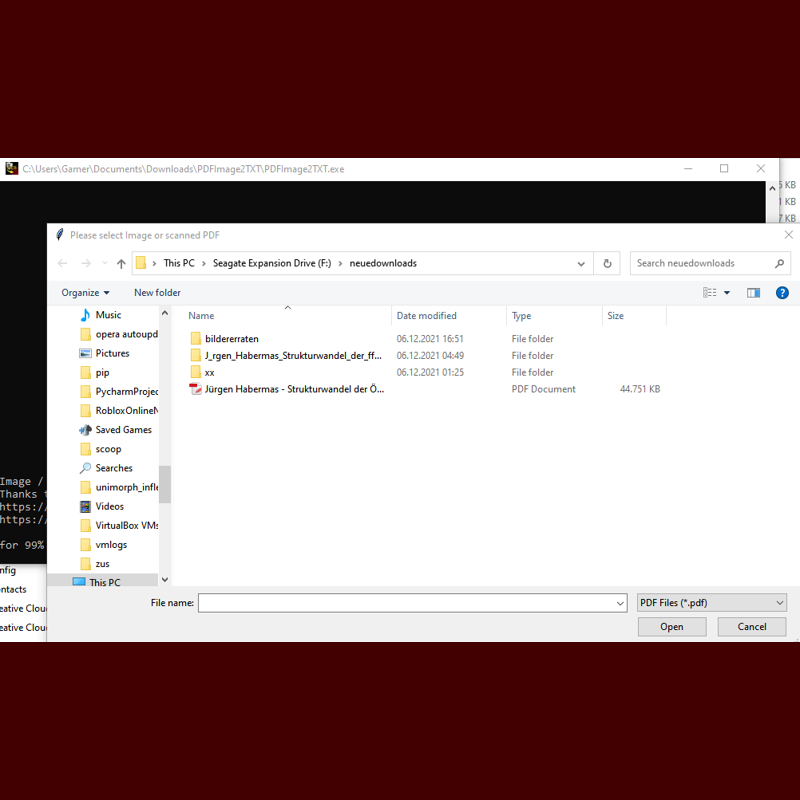
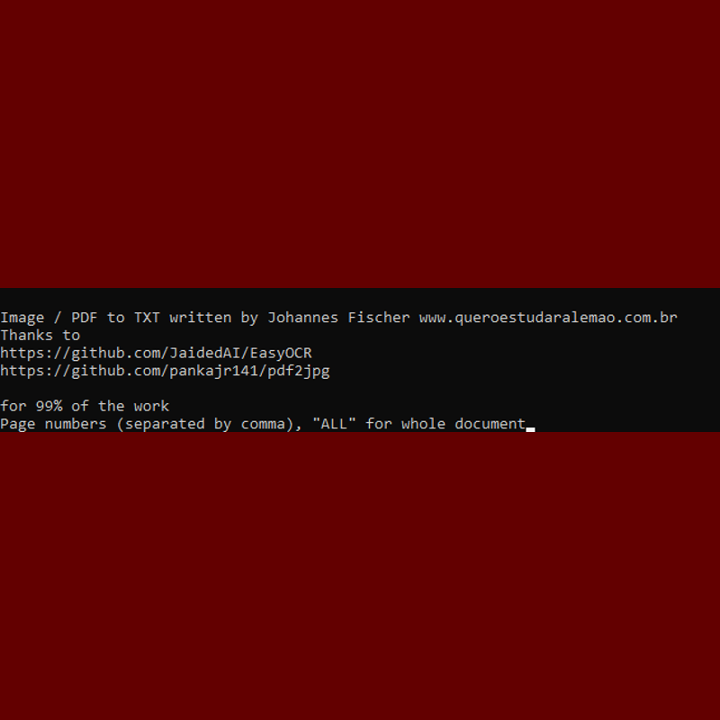
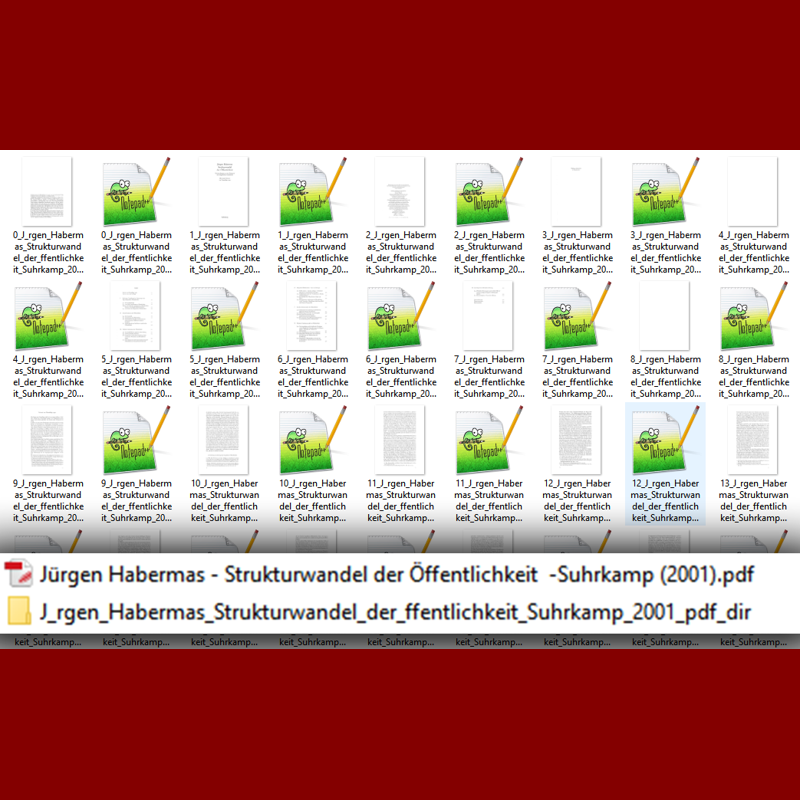
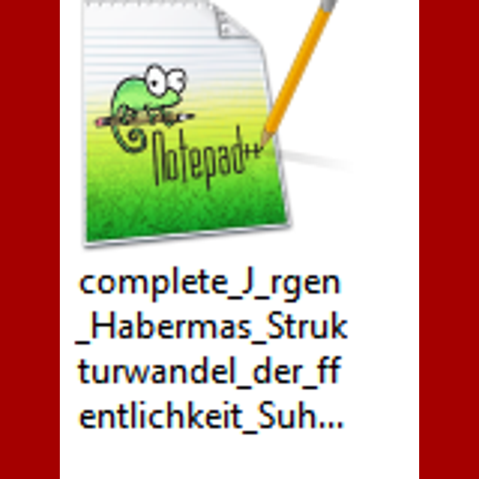
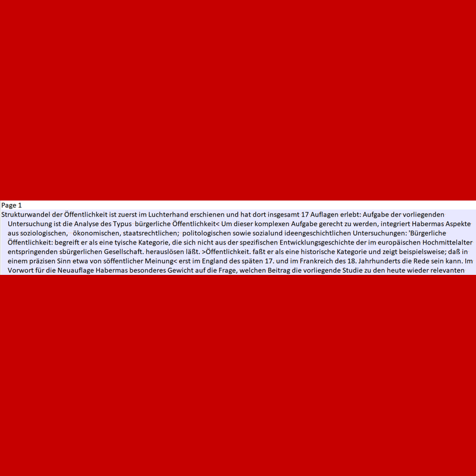

<p align="center"><a href="https://twitter.com/Aprender_alemao"></a><a href="https://www.facebook.com/estudaralemao/"></a><a href="https://www.instagram.com/estudaralemao/"></a><a href="https://www.youtube.com/c/wwwqueroestudaralemaocombr"></a><a href="https://api.whatsapp.com/send?phone=5511989782756&text=I%20want%20to%20know%20..."></a><a href="https://www.queroestudaralemao.com.br"></a><a href="https://br.pinterest.com/chucrutehans/"></a><a href="mailto:aulasparticularesdealemaosp@gmail.com?subject=I%20want%20to%20know%20...%20">
</a>

<a href="https://www.queroestudaralemao.com.br"></a></p>

<p align="center">
<a href=https://github.com/hansalemaos></a>
<a href=https://www.queroestudaralemao.com.br></a>
<a href=#></a>
<a href=https://www.dropbox.com/s/3ekoh2iayzg614g/PDFImage2TXT-SETUP.exe?dl=0></a>
<a href=#></a>
<a href=#></a>
<a href=#></a>
<a href=https://en.wikipedia.org/wiki/MIT_License></a>
<a href=https://codeload.github.com/liangjingkanji/DrakeTyporaTheme/zip/refs/heads/master></a>
<a href=https://github.com/dmhendricks/signature-social-icons></a>
</p><br>


# PDFImage2TXT - [DOWNLOAD INSTALLER HERE](https://www.dropbox.com/s/3ekoh2iayzg614g/PDFImage2TXT-SETUP.exe?dl=0)


## What can you do with it?

- Convert scanned PDFs to TXT.
- Convert scanned Documents to TXT.
- No coding required!! 
- Installer for Windows
- Source code included!
- MIT license

## How to install/run?

### Tutorial and things you have to know:

| _,.-'``'-.,_,.'`` Step 1 ``'.,_,.-'``'-.,_|Screenshot|
| -------------------------------------------------------------- |- |
<b><u><i>Defining the problem:</i></u></b><br>As a German teacher in Brazil, quite often I have<br>to read texts about philosophy, politics, medicine etc. with my<br>students.  Nowadays, the PDF format is the most common file format to<br>share text because of its simplicity.  <br><br><u><b>As a German teacher, I distinguish between 3 types of PDFs:</b></u>  <br><br>1) The <b>“text-is-text-format”</b>:<br>The text we see is a real text (for the computer). We can copy and<br>paste it and search through it using CTRL + F. If all PDFs were like<br>this, my tool wouldn’t be necessary.   <br><br>2) The <b>“text-is-picture-with-a-text-overlay-format”</b>: The text we are reading is actually a picture,<br>but there is a text layer on top of it. Sometimes that works so great that we can’t even notice a difference to the  “text-is-text-format”,<br>but many times we end up getting results like you can see on the right<br>picture when we use CTRL + C !   <br><br>3) The <b>“text-is-picture-format”</b>: For<br>us humans, it is a text but for the computer it is a picture, there<br>are no additional text layers. We can neither copy the text nor can we<br>use CTRL + F to search through it.| |

| _,.-'``'-.,_,.'`` Step 2 ``'.,_,.-'``'-.,_|Screenshot|
| -------------------------------------------------------------- |- |
<b><u><i>Why PDFImage2TXT?</i></u></b><br>There are some tools around to solve this problem, but I haven’t found<br>any which use [EasyOCR](https://github.com/JaidedAI/EasyOCR). EasyOCR is made by some Indian company and<br>produces the greatest results ever! It is incredible how good it is!<br>It is far better than everything that I have seen so far, even better<br>than Googles [Tesseract](https://opensource.google/projects/tesseract)! The only problem is that it is really slow,<br>but <b>I rather wait longer for great results than having shxxxy results right away.</b> <br>The only thing I needed to make EasyOcr work the way I<br>wanted to, was a way to convert the PDF file to images. After searching for about 5 minutes on [GitHub](https://github.com/), I found a nice tool to convert each page of a PDF<br>to a jpg file of good quality (300 DPI). Since  [pdf2jpg](https://github.com/pankajr141/pdf2jpg) <br> uses [Java](https://java.com/en/download/help/download_options.html), please ensure that<br>[Java](https://java.com/en/download/help/download_options.html) is installed on your system! If it is not installed, PDFImage2TXT<br>won’t work on your PC!| |

| _,.-'``'-.,_,.'`` Step 3 ``'.,_,.-'``'-.,_|Screenshot|
| -------------------------------------------------------------- |- |
<b><u><i>How to use it?</i></u></b><br><b>PDFImage2TXT is very simple to use:</b><br>1) Install it <br>2) Start it<br>3) Select the PDF or image you want to convert<br>4) If you convert a PDF file, you can decide what pages you want to convert to text:<br> <br><b>if you write <u>11,12,13,14,15</u> after having selected the PDF, the app will only convert the pages 11,12,13,14,15!</b><br>If you write <b>"ALL"</b>, the app will convert the whole PDF document to text!<br><br>5) If you convert a picture to text, there is nothing else to configure.| |

| _,.-'``'-.,_,.'`` Step 4 ``'.,_,.-'``'-.,_|Screenshot|
| -------------------------------------------------------------- |- |
<b><u><i>Behind the scenes:</i></u></b><br>You don't have to choose a name for the output folder or file! During the<br>process, a folder with the same name as your PDF + the ending <b>"_dir"</b><br>will be created, and <b>special characters in the name of the folder </b> will be<br>replaced by underlines.  <br><br><i>(Example: Jürgen Habermas - Strukturwandel der Öffentlichkeit  -Suhrkamp (2001).pdf <b>becomes</b> J_rgen_Habermas_Strukturwandel_der_ffentlichkeit_Suhrkamp_2001_pdf_dir)</i><br><br> <b><u> <i>Please make sure that there isn’t already a folder with that name!</i></u></b><br>  Inside the folder, there will be <b>2 files for each page</b>: one <b>JPG</b> and one <b>TXT</b>| |

| _,.-'``'-.,_,.'`` Step 5 ``'.,_,.-'``'-.,_|Screenshot|
| -------------------------------------------------------------- |- |
Once the entire process is done, PDFImage2TXT will create a single TXT file by joining all TXT files<br> <b>The final TXT file will be in the same folder and will contain the prefix "complete"!</b><br> <b><u>Everything that you want is in that file! You only need that file!</u></b><br> If you want, you can delete everything else!| |

| _,.-'``'-.,_,.'`` Step 6 ``'.,_,.-'``'-.,_|Screenshot|
| -------------------------------------------------------------- |- |
As you can see, <b>thanks to EasyOcr the results are almost perfect!</b> <br><b><u>The script I wrote, takes care of the hyphens at the end of each line. It<br>makes sure that all separated words are not separated in the converted<br>document!</u></b>  PDFImage2TXT took about <b>1h15m</b> for a PDF with around<br><b>1,000,000 characters</b>. I used an Intel i5-9600KF @ 3.7 GHz with 6<br>Cores. <i>It should be a lot faster with CUDA enabled (for everybody with<br>an NVIDIA GPU), but I couldn't get it to run on my PC. I am able to<br>use Cupy, OpenCV and Spacy with CUDA, but not Easy OCR.  If you have<br>any solution, please tell me/us! It would be nice to implement that<br>feature!</i>| |


## License

```
PDFImage2TXT - Copyright (C) 2021 Johannes Fischer www.queroestudaralemao.com.br

Permission is hereby granted, free of charge, to any person obtaining a copy of this software and associated documentation files (the "Software"), to deal in the Software without restriction, including without limitation the rights to use, copy, modify, merge, publish, distribute, sublicense, and/or sell copies of the Software, and to permit persons to whom the Software is furnished to do so, subject to the following conditions:

The above copyright notice and this permission notice shall be included in all copies or substantial portions of the Software.

THE SOFTWARE IS PROVIDED "AS IS", WITHOUT WARRANTY OF ANY KIND, EXPRESS OR IMPLIED, INCLUDING BUT NOT LIMITED TO THE WARRANTIES OF MERCHANTABILITY, FITNESS FOR A PARTICULAR PURPOSE AND NONINFRINGEMENT. IN NO EVENT SHALL THE AUTHORS OR COPYRIGHT HOLDERS BE LIABLE FOR ANY CLAIM, DAMAGES OR OTHER LIABILITY, WHETHER IN AN ACTION OF CONTRACT, TORT OR OTHERWISE, ARISING FROM, OUT OF OR IN CONNECTION WITH THE SOFTWARE OR THE USE OR OTHER DEALINGS IN THE SOFTWARE.

```

## Donations 

If this project has helped you somehow, consider donating a small amount. After being absent from computer programming for more than 20 years, I started again this year. At the beginning of 2021, I suffered from a bone infection and had to spend more than 3 months in hospital (only laying in bed!). To kill time, I stared learning Python, which rapidly became something bigger for me than just a "time killer".
[](https://www.paypal.com/donate/?hosted_button_id=TXH4HS4M54VV2)

